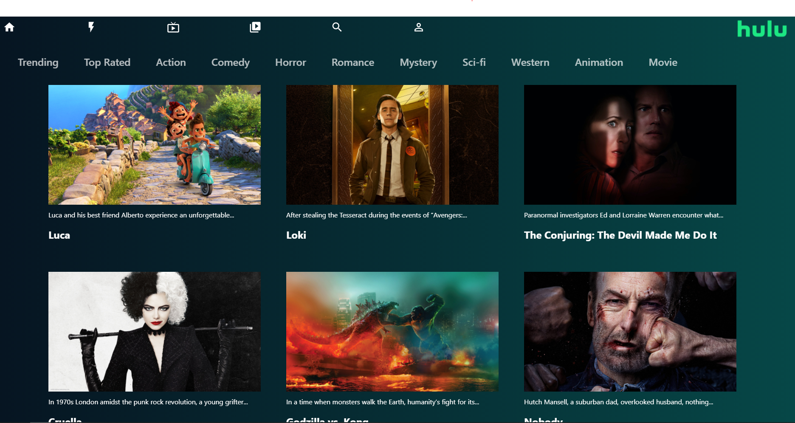
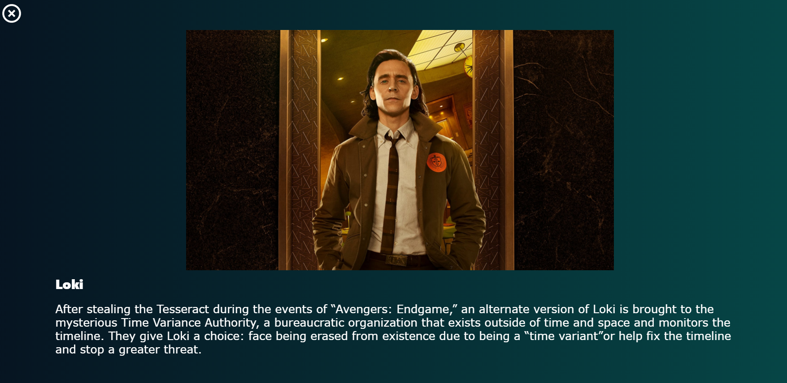
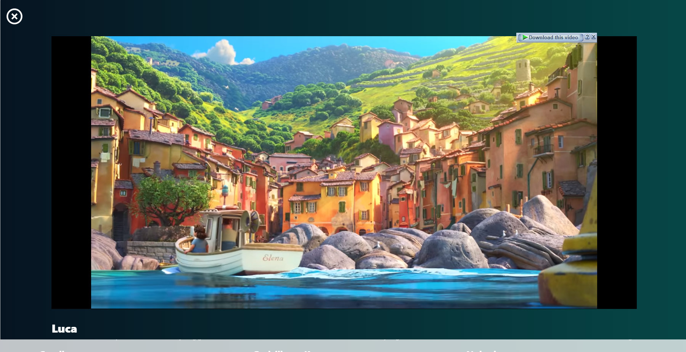

# Trailer-Flix 😁

This is a Trailer-flix built with react. This app has all the basic features like generas categories, with ability to watch trailers of all the available movies and shows as well as read the description.

<h2> Home Screen </h2>



<h2> Reading Description </h2>



<h2> Watching Trailer </h2>



# Project Setup

## Setup Directories

```cmd
cd/you_desired_directory/
mkdir any_name
```

## cloning the project

```bash
    git clone https://github.com/12srishti12/front.git
```

## Installing dependencies

```bash
    npm install | npm i | yarn install | yarn
```

## Running Project Locally

```bash
    npm start | yarn start
```


